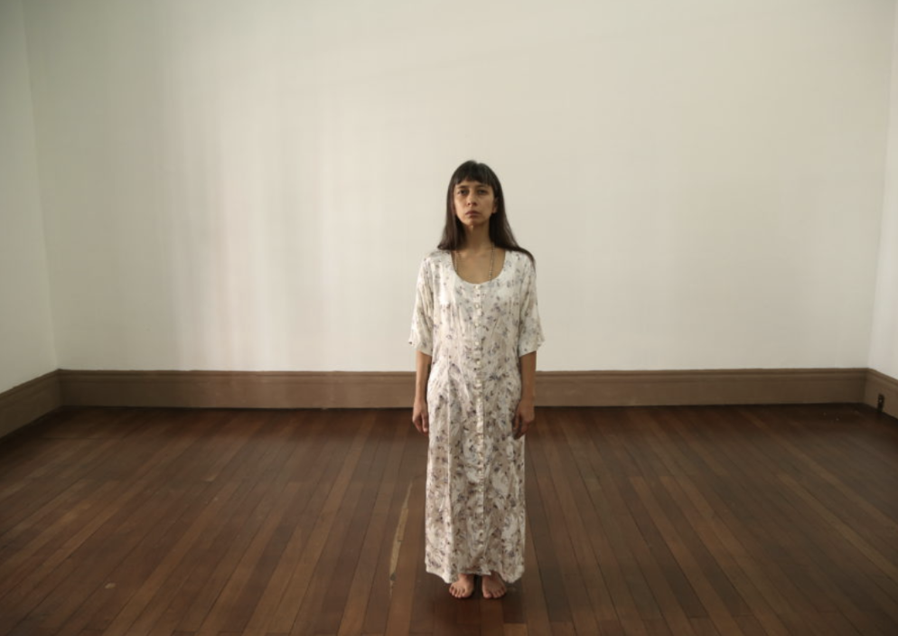
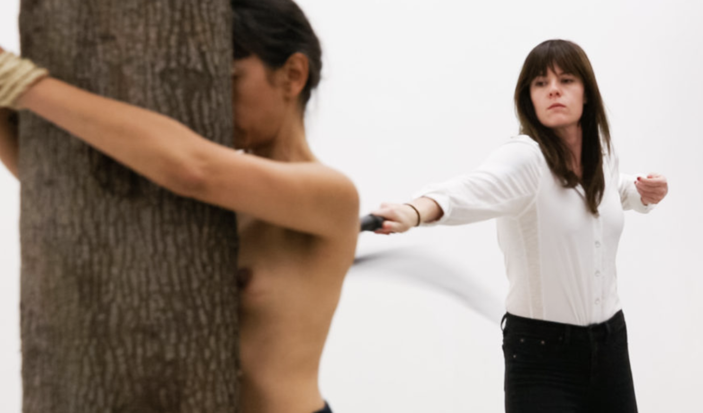
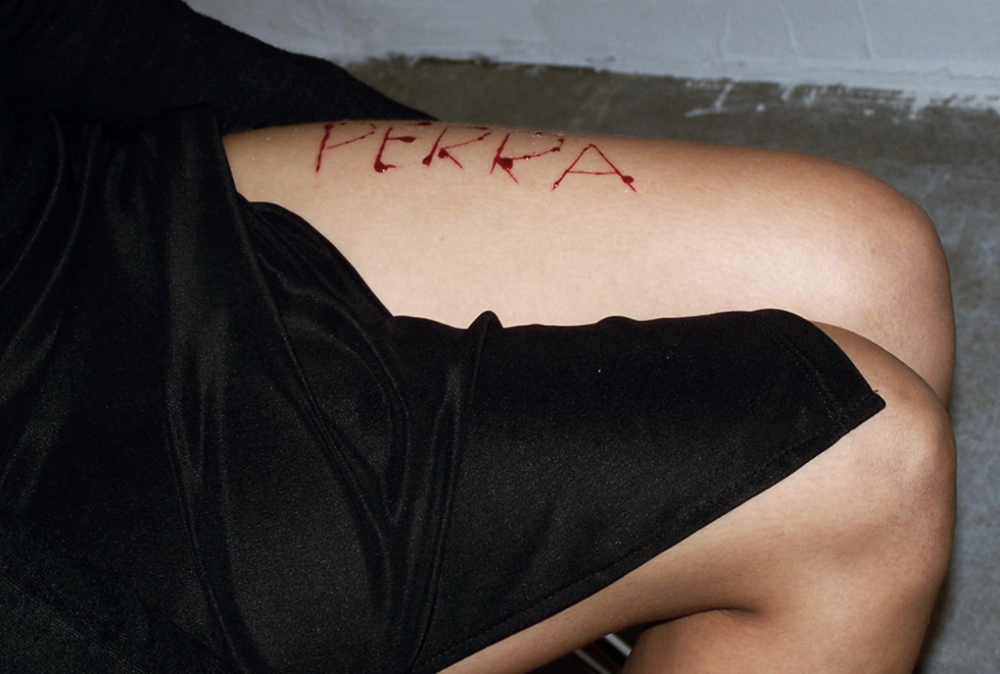
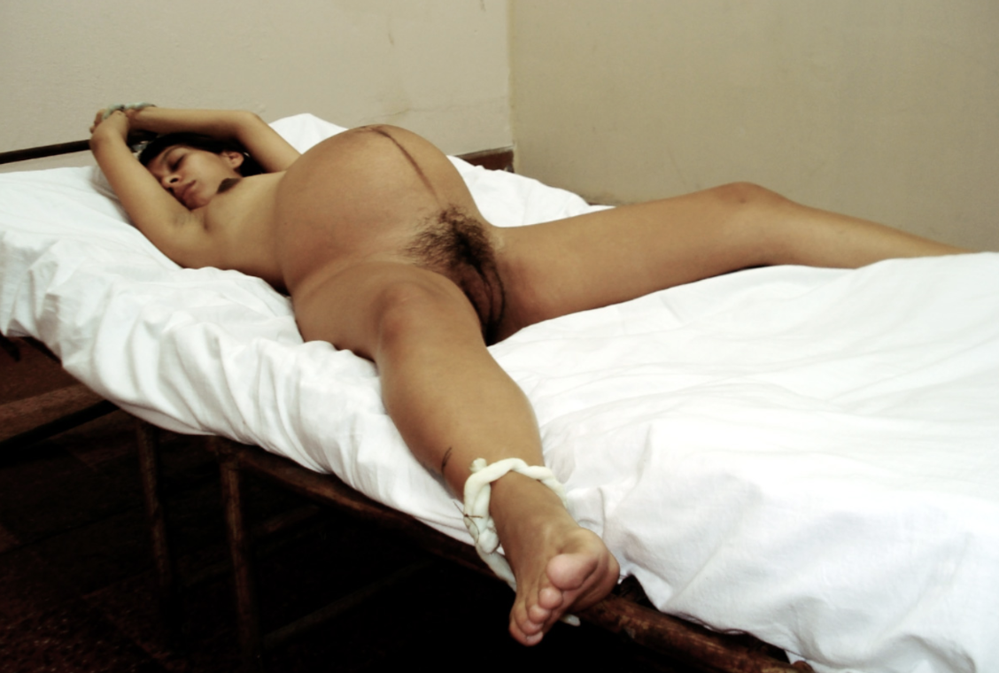

# ¿Qué dirán de mí si un día aparezco muerta? Feminicide, Latinidad, and State Violence from the lens of Regina José Galindo

_Submitted on May 5, 2019 as part of the Latina Feminisms Seminar with Prof. Leticia Alvarado_

> "There are no survivors of feminicide. All we have are the voices of witness– survivors (families) who speak for them. As the most extreme expression of crimes against women’s life and liberty, feminicide names the absolute degradation and dehumanization of female bodies." (Fregoso and Bejarano 11)

In her performance piece _Presencia_, the Guatemalan artist Regina José Galindo stands in protest for the victims of feminicide[^1] in Guatemala[^2] stating that "she doesn't want to put herself in people's shoes; she wants to put herself in people's dresses." Thirteen dresses, thirteen women. Although there are no survivors, Galindo aims to invoke their presence and, by interrupting public spaces, show the impact that feminicide has as a form of systemic violence. In this paper, I aim to show the ways in which the work of Regina José Galindo advances the understanding of the term _feminicide_ as Fregoso and Bejarano present in _A Cartography of Feminicide in the Américas_. I will first provide a broad context of the difference between these terms, and will then use the work of Galindo to understand the ways in which feminicide is embodied through performance art.

In some of the literature on the murder and torture of women, the terms femicide and feminicide have been used interchangeably (Fregoso and Bejarano 3). Yet, building on the generic definition of femicide as "the murder of women and girls because they are female" (Russell 15), Fregoso and Bejarano define _feminicide_ as systemic violence rooted in social, political, economic, and cultural inequalities. In other words, the murder of women and girls founded on a gender power structure; gender-based violence that is both public and private, implicating both the state (directly or indirectly) and individual perpetrators (private or state actors). They emphasize that their analysis focuses on the intersection of gender dynamics with the cruelties of racism and economic injustices in local and global contexts (5). Moreover, they follow Lagarde’s critical human rights formulation of feminicide as a ‘‘crime against humanity’’ (xxiii). Thus, Fregoso and Bejarano's definition of feminicide includes the violations which involve systemic and structural forces, a multiplicity of factors and intersecting logics (12).  
Although the terms femicide and feminicide are still evolving and under construction, Fregoso and Bejarano argue that the use of the term feminicide in their work is both political, in that they aim to advance a critical transborder perspective, and theoretical, in that they aspire to center the relevance of theories originating in the global South for the formation of an alternative paradigm (3). Given the etymological origins of the word, the translation of _feminicidio_ into feminicide rather than femicide is designed to reverse the hierarchies of knowledge and challenge claims about unidirectional (North-to-South) flows of traveling theory (Fregoso and Bejarano 5).

Given this theoretical context, we can begin to look at the work of Regina José Galindo in conversation with a larger understanding of violence against women, as part of a global system. Regina José Galindo is a visual artist and poet, whose main medium is performance, and was born in Guatemala City in 1974. She lives and works in Guatemala, using its own context as a starting point to explore and accuse the ethical implications of social violence and injustices related to gender and racial discrimination, and human rights abuses arising from the endemic inequalities in power relations of contemporary societies (reginajosegalindo.com).

In a 2015 interview for the Guggenheim, Regina José Galindo said she believes that "art is universal or _should_ be universal." She later goes on to talk about how in her work she is also interested in going beyond her country because "death is the same, pain is the same, in the first world and in the third world" and "art is a human bridge that allows us to make these connections, because in the end, individuals are the same, we feel the same, and we are interconnected." As a Latin American artist, Galindo not only challenges the North-South production of knowledge, but herself creates art which returns knowledge to "the North." Galindo pushes the borders of art and our understanding of gender violence, and its divide between different parts of the world, with each piece that she creates. To understand Galindo's work, it is necessary to take a close look at individual pieces, focusing on the ways in which they further our framing of feminicide.

As an extreme form of gender-based violence, feminicide does not just function as a "tool of patriarchal control but also of racism, economic oppression, and colonialism" (Smith 417). Thus, woman's bodily integrity cannot be simply "physical" or restricted to a model of "personal injury." Rather, such violations involve systemic and structural forces, a multiplicity of factors and intersecting logics (Fregoso and Bejarano 12). In the piece _Make America Great Again/ El Azote_ (The Whip) (2017), a professional dominatrix was ​​hired to whip Galindo's back every time someone in the audience left a coin in a can that was ready for that. _El Azote_ can be interpreted as a representation of the ways in which capitalist behaviors contribute to the violence– exemplified in the form of a whipping– which show the physical violence inflicted upon women as part of violations involving systemic and structural forces, such as Fregoso and Bejarano suggest.

Moreover, we cannot ignore the way in which the title of the piece is clearly referencing the slogan of the president of the United States, Donald Trump, who in his 2016 campaign won through promises of white nationalism and border closing. Galindo is taking a stance in protesting the US political context, which affects attitudes towards immigration and violent practices against non-white bodies worldwide. She is showing us the pain caused by this regime and the systems that support it. Given that feminicidal violence finds fertile ground in social asymmetries and is most acute under conditions of ‘‘extreme marginalization and social, judicial and political exclusion" (Lagarde y de los Ríos 22), Galindo is once again questioning the closure of borders, and showing the ways in which this promise of a better America is coming at the expense of pain of the members of the "Américas," especially the most vulnerable ones.

Furthermore, Galindo is standing and letting pain be inflicted upon her. She shows her bare body to a spectating audience and a whip, leading us to make the decision of hurting her or not, but at the same time questioning the very fact of whether we have a decision. She leads us to think about our own consumption practices, and suggests that we are always part of this globalized system of exploitation that hurts us, and there is no escaping it. In a similar manner, Fregoso and Bejarano aim to question the either–or formulation to account for the ways in which all breaches are interconnected, both private and public (11). Can any of us separate ourselves from the violence inflicted upon women under this capitalist, nation-first system?

Yet, under this system of global violence, Galindo continues to protest the very literal ways in which violence is inflicted upon women's bodies, in forms other than death. In her piece _Perra_ (Bitch) (2005), Galindo takes a knife and writes the word Perra (Bitch) on her leg, denouncing the acts of violence committed against women in Guatemala, where bodies have appeared tortured and with inscriptions made with a knife. According to Fregoso and Bejarano, treating feminicide as the gendered form of homicide is misleading, given that it obscures the power differentials that feminist theorists have long contended increase women’s vulnerability to violence. Feminicide makes visible forms of violence that are rooted in a gender power structure, given that the specific brutality and severity of rape, sexual torture, and mutilation suggest high levels of misogyny and dehumanization of women (7).

In _Perra_, Galindo is alluding to this gender-specific violence that goes beyond the murder of women, showing the hatred that appears when inscribing dehumanizing gender-specific slurs onto their physical bodies. Taking this a step further, we can also interpret this piece as demonstrating the psychological harm that the patriarchal system creates in women. The devastation, the feeling of worthlessness, and symptoms of PTSD, that can make ultimately creates a system that makes us hurt ourselves. Galindo said she believes that "every victimizer at one time was a victim." (2015), thus implying that violence is not unidirectional, but rather exists in a complex web of institutional and historical oppressions, that feminicide encompasses.

Continuing on the framework of gender-specific crimes, rape is one of the forms of torture that have been repeated against women especially around times of war, and the work of Galindo emphasizes the protest of victims of the civil war in Guatemala. In the piece _Mientras, ellos siguen libres_ (In the meantime, they are still free) (2007), with eight months of pregnancy of her own daughter, Galindo remains tied to a bed, with real umbilical cords, in the same way in which indigenous women, pregnant, were tied, to later be raped during the armed conflict in Guatemala. In her website she shows two testimonies of women, one was three months pregnant and was hit, raped, and lost her baby, and the other was seven months pregnant and was raped fifteen times, and lost her baby the next day (reginajosegalindo.com).

The rape of pregnant women, in a system that at many times reduces women to their capacity to be child-bearing subjects, suggests a level of violence that goes beyond. Moreover, this violence reaches an intergenerational aspect, not only violating the women herself, but also their children coming into this world, in the context of military torture. Thus, the unbridled misogynist practices of military regimes illuminate the intersections of ‘‘political repression’’ and ‘‘patriarchal culture’’ as mutually constituting forces (Fregoso and Bejarano 13). By using umbilical cords, a piece of the body that marks the beginning of life, as the very object that keeps the women trapped and ready for torture, Galindo protests the gendered violence that occurs at every stage of life.

Furthermore, the title alludes to an even bigger problem, which was shown in the piece _Presencia_ as well: the lack of justice and impunity. "They are still free" says Galindo. Equating feminicide to part of a larger global system is important, yet in this system there is space for erasure of the true perpetrator of violence. Fregoso and Bejarano mention that just as significant is the ‘‘historic structure of impunity’’ resulting from amnesty laws that have failed to hold state officials and former members of the security forces accountable for egregious crimes (14). In Guatemala, ‘‘genocidaires have never been brought to justice and impunity reigns more than a decade after the signing of peace accords’’ (Sanford 105). In spite of the atrocities– rape, mutilation, physical harming, murder– there is still a lack of justice.

Additionally, in this institutional framework of understanding femicide, the women can herself be blamed. In Galindo's famous poem _¿Qué dirán de mí si un día aparezco muerta?_ (What will they say about me if one day I appear dead?), she questions how her very own death can be used against her, and the ways in which her non-normative behavior can be blamed as the cause of her death.  
The start of the poem says:

_Abrirán mis gavetas_ (they will open my drawers)  
_sacarán mis calzones al sol_ (they will take my underwear to the sun)  
_revisarán minuciosamente mi pasado_ (they will thoroughly check my past)  
_y dirán_ (and they will say)  
_quizás_ (maybe)  
_que lo merezco_ (that I deserve it)

_Cada periódico hará un despliegue de mis defectos mis vicios_ (Every newspaper will display my flaws)  
_mis vicios_ (my addictions)  
_mis fallas_ (my faults)  
_y dirán_ (and they will say)  
_quizás_ (maybe)  
_que lo merezco_ (that I deserve it)

Here, Regina José Galindo is challenging the ways in which the very deaths of women are so ingrained in this systemic violence, that many times the victims are themselves blamed. This poem allows us to continue the framing of feminicide as systemic violence, a violence in a system which circulates the blame not only to the State but also to women. And if women are blamed for their own murders, impunity continues. The poem ends with the phrase _¿Qué dirán de tí si un día apareces muerto?_ (What will they say of you if one day you appear dead (masculine)?), posing a question to the patriarchal system itself, and invoking its responsibility. In every one of her pieces, Galindo shows us the complicated intertwinings of power that create violence upon women.

Time and time again, Galindo's work builds upon the definition of _feminicide_ that Fregoso and Bejarano present. First, she insists on implicating the State and the different structural forces in play, in her definition and protest of feminicide. Second, as a Latin American woman who tries to universalize the expression of pain, and references the violence that the US has inflicted upon Latin America, her work crosses borders, challenging the discourse of North to South production of knowledge.

It is true that we must "insist on being shocked [and] refuse to become immune to the large-scale violence" (Fregoso and Bejarano 1). Regina José Galindo will insist on shocking any spectator of her art, which violently demonstrates the realness of violence against women. She shows it to us directly. Her reproduction of the violence towards women expands national borders, and implicates the systemic violence of the global system. Through her performance she has accomplished to demonstrate the many layers and complicated webs of structural power that perpetuate _feminicide_.

### Works cited

- “Regina José Galindo.” _Regina José Galindo_, reginajosegalindo.com/.
- Fregoso, Rosa Linda and Cynthia Bejarano. 2010. "Introduction: A Cartography of Feminicide in the Américas." In _Terrorizing Women: Feminicide in the Américas_. Duke University Press
- Lagarde y de los Ríos, Marcela. 2006. ‘‘Introduccíon: Por la vida y la libertad de las mujeres.’’ In _Feminicidio: Una perspectiva global_, ed. Diana E. H. Russell and Roberta A. Harmes, 15– 42. Mexico City: Centro de Investigaciones Interdisciplinarias en Ciencias y Humanidades and Universidad Autónoma de Mexico.
- Museum, Guggenheim. “Artist Video: Regina José Galindo, La Víctima y El Victimario (English Captioned).” YouTube, YouTube, 4 Aug. 2015, www.youtube.com/watch?v=oeDytcs-wsk&t=281s.
- Sanford, Victoria. 2008. ‘‘From Genocide to Feminicide: Impunity and Human Rights in Twenty-First Century Guatemala’’ _Journal of Human Rights_ 7, no. 2: 104– 22.
- Smith, Andrea. 2006. ‘‘Heteropatriarchy and the Three Pillars of White Supremacy: Rethinking Women of Color Organizing.’’ In _Color of Violence: The Incite! Anthology_. Cambridge, Mass.: South End Press.
- Russell, Diana E. H. 2001. ‘‘Defining Femicide and Related Concepts.’’ In _Femicide in Global Perspective_, ed. Diana E. H. Russell and Roberta A. Harmes, 12– 28. New York: Teachers College Press.

[^1]: While I type this paper, the word feminicide has a red line under it, violently letting me know that this word is not yet recognized by the institutions that govern language.

[^2]: In a period of 5 years, 3.585 cases of murdered women were reported in Guatemala (Statistics from INACIF and Fundación Sobrevivientes). A lot of these crimes were committed by the partner or ex partner. Most of these cases remain in impunity (reginajosegalindo.com).
