# Coping with Personhood through the Illustrations of Carolina Hicks: An Exploration of Latinidad, Identity, Trauma Healing, and Third World Feminism

_Submitted on May 31, 2019 as part of the Latina Feminisms Seminar with Prof. Leticia Alvarado_

Carolina Hicks or "Subtle Ceiling[^1]" is a first-generation Colombian female artist who produces work in a variety of mediums. Her art is "made to cope with the difficulties of personhood– with being ok with taking up space, dual identities, code switching, and trying to heal trauma (or at least make it less violent, less uncomfortable)– translating feelings through visuals" because, in her own words, "being a person is the most hardcore thing I've ever done" (Hicks, interview). In the following paper, I aim to explore the ways in which Carolina Hick's illustrations, and the personal experiences that drove her to creating them, fall into the project of Third World Feminism, by putting Gloria Anzaldúa's concept of _nepantla_, Audre Lorde's analysis of the _erotic_ and Juana María Rodríguez's notions of _queer latinidad_, in conversation with Carolina Hick's exploration of latinidad, identity, and healing of trauma through difference.

Women-of-color feminism offers "models for building radical solidarity, working vigorously with difference to create coalitional identities of resistance finding wholeness in our contradictions and connection where there is seemingly disconnection" (Violet 486). Chela Sandoval describes this model as differential consciousness, the fifth mode of oppositional consciousness which "generates grounds for making coalitions with decolonizing movements for emancipation in global affinities and associations and retroactively provides a structure, a theory, and a method for reading and constructing identity, aesthetics, and coalition politics that are vital to a decolonizing postmodern politics and aesthetics, and to hailing a “third-wave,” twenty-first-century feminism" (44). This Third World Feminist consciousness enables movement “between and among” different ideological positionings (Sandoval 57). Using this definition of Third World Feminism, as one which exists to build coalitions between parts that seem disconnected, we can begin to look at Hick's work.

In _This Bridge Called My Back_, in the very beginnings of the Third World Feminist movement, Moraga and Anzaldúa argued for the importance of creating a "theory in the flesh," "one where the physical realities of our lives–or skin color, the land or concrete we grew up on, our sexual longings– all fuse to create a politic born out of necessity ... pursuing a society that uses flesh and blood experiences to concretize a vision that can begin to heal our "wounded knee" (19). In this way, Hicks's art is exactly that: "theory in the flesh." After looking within herself she wants to use her experiences and pain to create a political conversation which pushes forth the voices of those that long liberation.

One of the beautiful aspects of Hick's work is that she starts looking inwards at the ways in which her identity has been broken into multiple pieces that can seem disconnected, but through her illustrations, readings, and writings, aims to find the common ground and healing between them. Hicks says: "with all this internal conflict, opposing forces, contradicting shit that's always taking place (which is essentially, I have been colonized and I am the colonizer, both at the same time) my art practice functions, almost literally, as a rope I've made for myself to hold onto when I'd really like to just disappear entirely from Being. Processing, coping, de-coding, translating my reality through the specific medium of drawing has been a very personal (turned public) way in which I can justify continuing to stay alive."

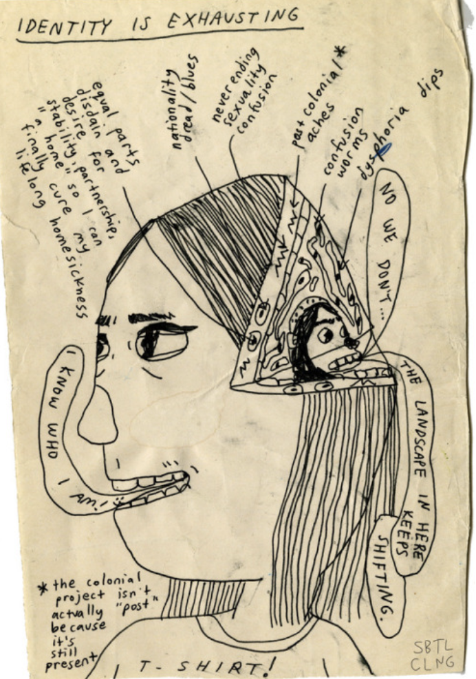
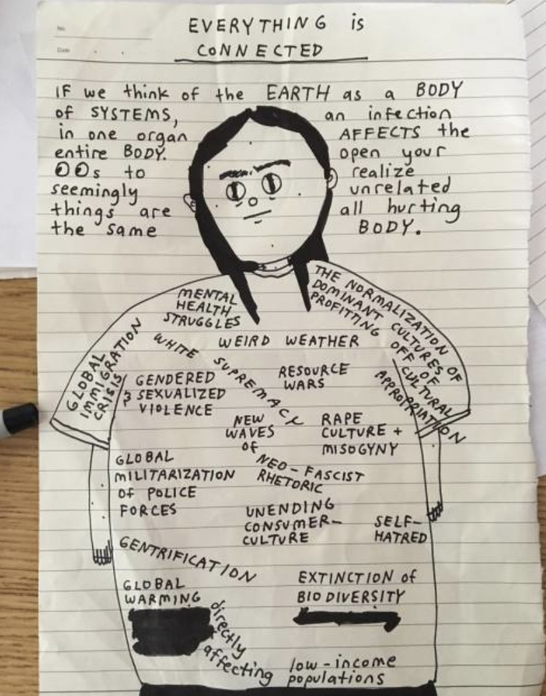

Hicks explores the dimensions of identity from a variety of points of view: gender, nationality, sexuality, race, and the effects of patriarchy, capitalism, and colonialism on the individual. It is useful to think of Juana María Rodríguez's definition of identity: "Identity is about situatedness in motion: embodiment and spatiality. It is about a self that is constituted through and against other selves in contexts that serve to establish the relationship between the self and the other ... identity is not merely a response to culturally defined differences, but is continually engaged in unpacking the stream of “paradoxes and contradictions” that inform the subject’s relationship to other subjects and the discourses that surround them" (Rodríguez 5-6). Thus, identity informs her art and her art permits her to understand her own identity, but at the same time cannot be separated from it. As Anzaldúa says, "a woman of color who writes poetry or paints or dances or makes movies knows there is no escape from race or gender when she is writing or painting. She can't take off her color and sex and leave them at the door of her study or studio. Nor can she leave behind her history. Art is about identity, among other things, and her creativity is political" (_Reader_ 134).

Art creates a spiritual act of looking within oneself. "Inherent in the creative act is a spiritual, psychic component-one of spiritual excavation, of (ad)venturing into the inner void, extrapolating meaning from it and sending it out into the world. To do this kind of work requires the total person- body, soul, mind, and spirit" (Anzaldúa, _Reader_ 135). Yet at the same time, creating art exists in this patriarchal and white systems of power where "art is a struggle between the personal voice and language, with its apparatuses of culture and ideologies, and art mediums with their genre laws-the human voice trying to outshout a roaring waterfall" (Anzaldúa, _Reader_ 135). Hicks struggles with this, expressing a constant reevaluation of what her art means, of its self indulgence, and the power systems in which it is being shared and created (which in large part has been via social media).

Hicks's goes deep within her psyche, reliving and unpacking the many aspects that are creating inner turmoil and colonization of her psyche, to expose to us the many aspects that have brought upon trauma trying to cope with the difficulties of personhood. Anzaldúa says that "tu camino de conocimiento requires that you encounter your shadow side and con­front what you’ve programmed yourself (and have been programmed by your cultures) to avoid (desconocer), to confront the traits and hab­its distorting how you see reality and inhibiting the full use of your facultades" (_Light_ 118). In Hick's piece on "unlearning as an act of purging, mourning the ghosts you need to exorcise from your psyche in order to heal your heart" (December 20, 2016) she talks about recognizing the dark sides of herself. She very vulnerably unpacks the many aspects that she has learned and hurt her, and that she must strip away from in order to heal. In another illustration, she says 'I feel a destruction in me happening– a type of soft death giving way to a new birth of self. Confrontation of self" (June 10, 2016). Thus, "by redeeming your most painful experiences, you transform them into something valuable, algo para “compartir” or share with others so they, too, may be empowered." (Anzaldúa, _Light_ 117) Hicks passes "_through_, not over, not by, not around, but through" (Moraga, _Bridge_ xxxvi) her trauma.

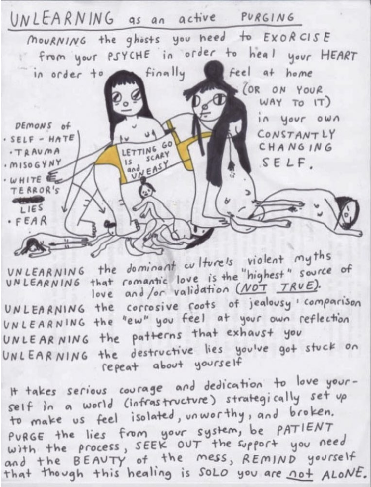
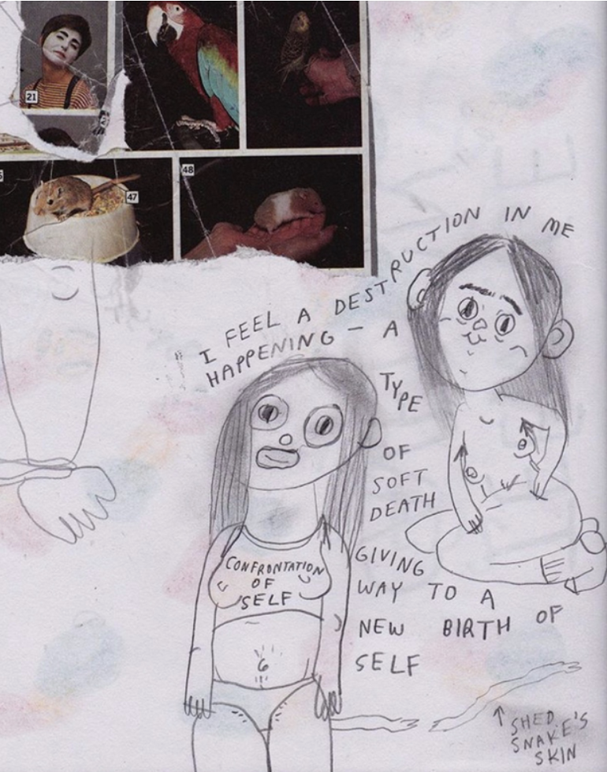

Hick's work follows the concepts that Anzaldua presents in _Light in the Dark_, that "the healing of our wounds results in transformation, and transfor­mation results in the healing of our wounds." (Anzaldúa, _Light_ 19) She does not aim to resolve, just heal, through the making and unmaking of her psyche and internal conflict and family history. Hicks has a piece on healing in which she posts the caption: "healing is a subjective experience. but dominant narratives really can and do take up space in the virtual / irl terrains. when the process of healing is aestheticized through a white rad. feminist frame, it can make you feel like your version of healing is far too angry, too ugly, not soft, not tender, not romantic enough. It's been feeling like one of many elephants in the room when thinking about what's trending and widely accepted in contemporary art movements (even internet ones). maybe it's bitterness and disillusionment? idk but if you feel out of place and like you're not healing right, just know that any attempt to try and heal in this world is a victory and you're doing it" (Aug 17, 2017). She is challenging the hegemonic liberal feminist view, and showing her own way of feeling through her different intersecting identities.

Hick's commented that one of the readings that has impacted her the most was Audre Lorde's _Uses of the Erotic_. In one of her illustrations, she directly addresses the topic of the erotic. In her essay, Lorde says that "there are many kinds of power, used and unused, acknowledged or otherwise. The erotic is a resource within each of us that lies in a deeply female and spiritual plane, firmly rooted in the power of our unexpressed or unrecognized feeling. In order to perpetuate itself, every oppression must corrupt or distort those various sources of power within the culture of the oppressed that can provide energy for change. For women, this has meant a suppression of the erotic as a considered source of power and information within our lives" (Lorde 87). Lorde makes us think in different ways in which the erotic empowers women, because, for fear of this power, we are taught to separate the erotic demand from most vital areas of our lives other than sex (Lorde 88). Hicks wants to understand the inner erotic intuition that exists within her personhood as a woman.

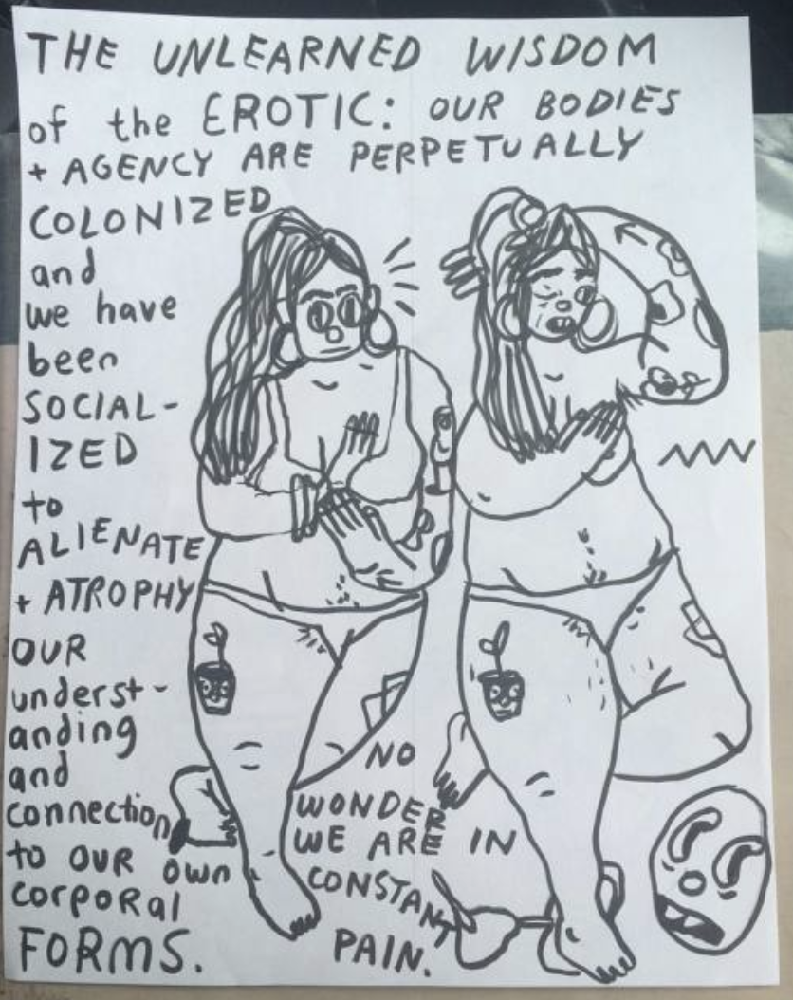

For Moraga, "women of color have always known, although we have not always wanted to look at it, that our sexuality is not merely a physical response or drive, but holds a crucial relationship to our entire spiritual capacity ... Simply put, if the spirit and sex have been linked in our oppression, then they must also be linked in the strategy toward our liberation. To date, no liberation movement has been willing to take on the task. To walk a freedom road that is both material and metaphysical. Sexual and spiritual. Third World feminism is about feeding people in all their hungers" (132). Hicks looks at the intuition and sexuality in a similar way. The way that she takes the erotic as presented by Audre Lorde, and Latina Feminists such as Moraga and Anzaldúa, and incorporates it into her illustrations, shows the way in which she believes in this inner intuition of the women of color to decolonize their psyches and unite in the search for liberation.

Yet, there exists pain when you are not following your intuition or when the power of oppression in the world do not let you reach your full humanity. Hicks uses the language of the psyche a lot. Hicks talks about a "psychic hangover, the fracture felt when you've betrayed your own intuition. Life is loud: you are no longer who you thought you were" (March 18, 2019). Similar to the "body grief that touches women of all races, ethnicities, abilities, ages, classes. And that suffering is a deep psychic wound, requiring a constant internal balancing act." (Dykewomon 453). There are times in which one breaks with this intuition and created a rupture.

One of the ruptures that occurs is feeling as the oppressor. Moraga states that, as a women of color, it is necessary to ask yourself: "How have I internalized my own oppression? How have I oppressed? Because instead, we have let rhetoric do the job of poetry." (Moraga, _Bridge_ 25). Lorde in her analysis of the erotic also adds, "when we look the other way from our experience, erotic or otherwise, we use rather than share the feelings of those others who participate in the experience with us. And use without consent of the used is abuse" (Lorde 90). Hicks feels herself a part of the colonizer and colonized dichotomy, understanding that she can be both an oppressor and oppressed at the same time. She told me a story: "When I was in a artist residency in Colombia, I came in calling out misogyny/sexism/racism, but they told me "you can't come bringing in your ideas from the US, feminism from the north, and explaining us how we are". I then realized I wasn't from there." In this way, she is recognizing that in spite of the fact that she is always evolving and learning about how to become a member of the Third World Feminism movement, she can also come in to other communities bringing her own "anglo" ideas of feminism.

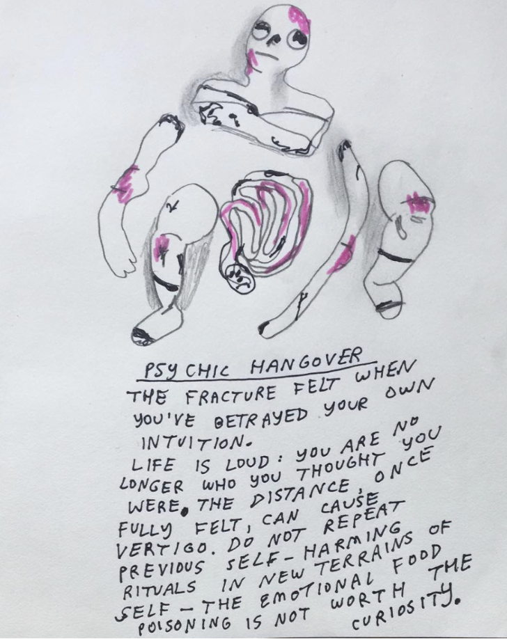

Nonetheless, from rupture, and through art, reading, and healing, Hicks finds a way to make sense of these ruptures and sense of constant displacement. One of the main themes in Hick's art, feeling "ni de aquí ni de allá.[^2]" She explains: "I think a lot about these huge topics, as they are part of my everyday reality and the deep internal conflicts with the "not enough"ness of multiple facets of my identity. I'm not at all white enough to be white, I'm not "brown" enough to comfortable take up space in explicitly "brown" spaces. I am 'mestiza' coming from very classist/colorist family roots Medellin, who are all very proud to say "generations ago, we came directly from Spain, you know?" But my father, from Ibague, is not as white-passing and his grandmother was indigenous, de Tolima. So, from the get-go, there's this colonial framework set up within my own body/psyche + sense of nationalism + skin color, and I find myself, first gen. of my family out of Colombia, born in the valley of Los Angeles, raised in a mostly white suburb by an affluent Black-American man (my stepdad who raised me) + my mom. It's thick/complex!" Like Moraga who admits she feels "both bleached and beached, " a woman with a foot in both worlds who refuses the split, feels the necessity for dialogue, sometimes urgently (Moraga, _Bridge_ 29).

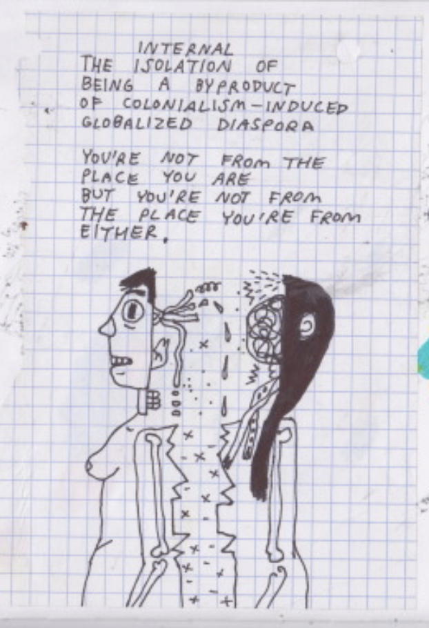
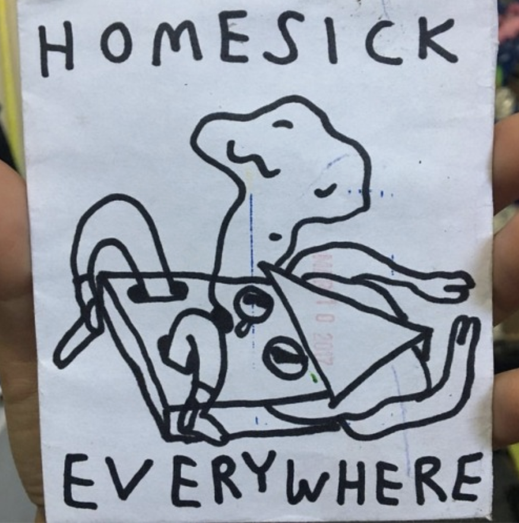

Anzaldúa, in _Light in the Dark_, describes seven stages of conocimiento, one of them being Nepantla. "The binaries of colored /white, female/male, mind / body are collapsing. Living in nepantla, the overlapping space between different perceptions and belief systems, you are aware of the change­ ability of racial, gender, sexual, and other categories rendering the conventional labelings obsolete" (119). In a post on June 9, 2018, Hicks comments, "Roy (out and about in D.F.) makes me realize and dream of the psychic and political potential inherent in intentionally styling one’s self. As a form of protection, healing, expression of anger + pain, and mainly an expression of agency amidst collapse. Realizing that us void-swimmers, not quite from here pero tampoco from there, living in NEPLANTA (Gloria Anzaldua’s concept of the in-between-ness, ni de aquí ni de allá), can be multi-faceted and as multi-dimensional with our output as the time/space landscape(s) we are navigating."

Nepantla is a "psychological, liminal space between the way things had been and an unknown future. Nepantla is the space in­between, the locus and sign of transition. In nepantla we realize that realities clash, authority figures of the various groups demand contradictory commitments, and we and others have failed living up to idealized goals ... In nepantla we undergo the an­guish of changing our perspectives and crossing a series of cruz calles, junctures, and thresholds, some leading to a different way of relating to people and surroundings and others to the creation of a new world. Nepantleras such as artistas/activistas help us mediate these transi­tions, help us make the crossings, and guide us through the transfor­mation process—a process I call conocimiento" (Anzaldúa, _Light_ 17). Thus, when recognizing she is existing in Nepantla, Hicks is not only saying she exists in a feeling of in-between, but rather one that carries power, and knowledge. One that creates a bridge between identities constructed for us and spaces of healing. The clashing of identities, of creating art which talks about this inbetween, of creating art, existing in this space, is where the magic of Hick's work comes to exist.

Anzaldúa poses the question of "What if freedom from categories occurs by widening the psyche/body’s borders, widening the consciousness that senses self (the body is the basis for the conscious sense of self, the representation of self in the mind)? It follows that if you’re not contained by your race, class, gender, or sexual identity, the body must be more than the categories that mark you" (_Light_ 134) because "the pulse of existence, the heart of the universe, is fluid. Identity, like a river, is always changing, always in transition, always in nepantla. Like the river downstream, you’re not the same person you were up­ stream. You begin to define yourself in terms of who you are becoming, not who you have been" (135).

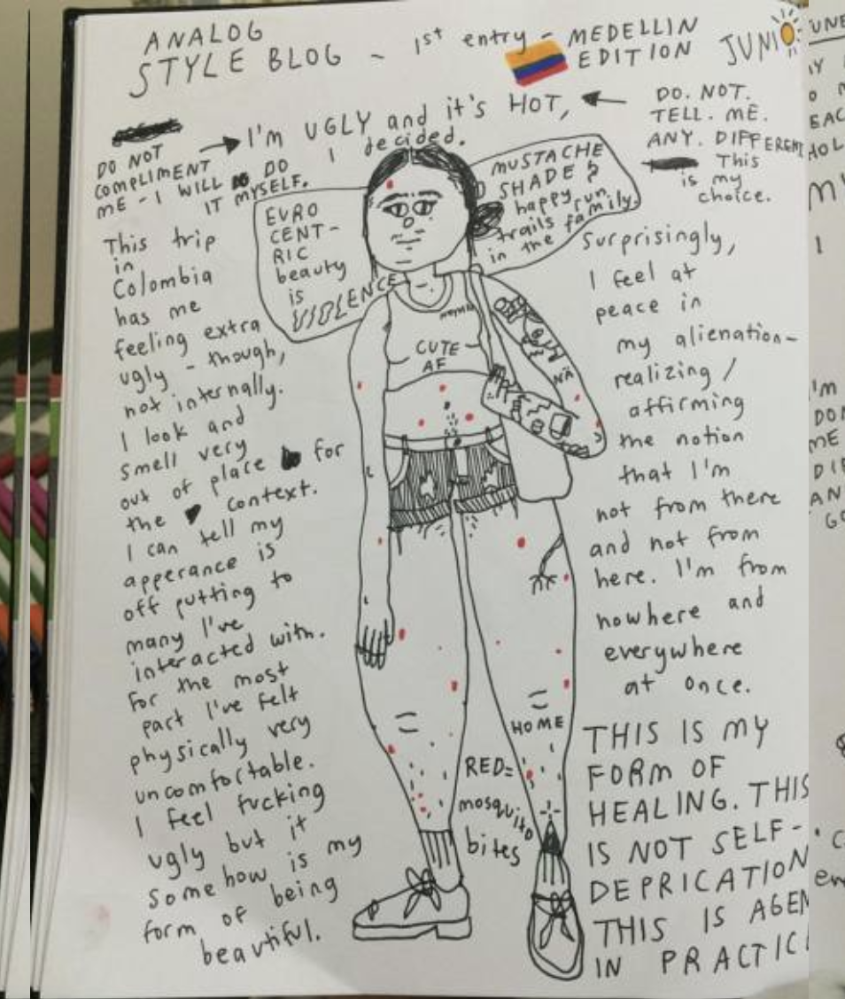

In one of her illustrations Hicks talks about her sense of her own body in a trip to Colombia. She says: "This trip in Colombia has me feeling extra ugly- though not internally. I look and smell very out of place for the context. I can tell my appearance is off putting to many I've interacted with. For the most part I've felt physically very uncomfortable. I feel fucking ugly but it somehow is my form of being beautiful. surprisingly, I feel at peace with my alienation-realizing/affirming the notion that I'm not from there and not from here. I'm from nowhere and everywhere at once. This is my form of healing. This is not self-deprecation. This is agency in practice" (June 21, 2016). Her radical act of feminism is existing as the fluid nepantlera that Anzaldúa describes, and is at the same time showing how her own "mother culture" is making her feel not at home. She understands that living with her "ugliness" is an act of healing. Moreover, when questioning where she even falls in within 'latinidad", Hicks is reflecting and understanding that "latinidad serves to define a particular geo political experience but it also contains within it the complexities and contradictions of immigration, (post)(neo)colonialism, race, color, legal status, class, nation, language, and the politics of location" (Rodríguez 9), and that, at the same time, "to be critical of one's culture is not to betray that culture (Moraga, _War Years_ 108)".

"Making faces" is my metaphor for constructing one's identity." (Anzaldúa, _Reader_ 125). One of the aspects that is very notorious of Hick's work is the strong "ugly" facial expressions she makes. They evoke feeling, and realness. They reflect what she views to be her trauma aunfolding. They can be uncomfortable and shocking, yet it is this very "ugliness" which shows the breaking down of identities and bringing them back together. And thinking about this image, we can also think about the ways in which Hick's thinks about the body of the female women.

In a illustration, Hicks writes "Hurting another Womxn is much more painful to sit with than hurting men. Internalized misogyny is a real fucking multidimensional poison. One that can really blur your vision and lead you towards harming yourself and worse, others." Hicks finds her queerness first in her understanding that the pain she inflicts on women hurts more than other. Similar to the ways in which Moraga says that it "is also the source of terror– how deeply separation between women hurts me. How discovering difference, profound differences between myself and women I love has sometimes rendered me helpless and immobilized ... Sometimes for me the "deep place of knowledge" Audre refers to seems like an endless reservoir of pain, where I must continually unravel the damage done to me" (_Bridge_ xxxviii). Moraga also talks about the fact that "it is not really difference the oppressor fears so much as similarity. He fears he will discover in himself the same aches, the same longings as those of the people he has shitted on ... We women have a similar nightmare, for each of us in some way has been both oppressed and the oppressor. We are afraid to look at how we have failed each other. We are afraid to see how we have taken the values of our oppressor into our hearts and turned them against ourselves and one another. We are afraid to admit how deeply "the man's" words have been ingrained in us. To assess the damage is a dangerous act" (_Bridge_ 27).

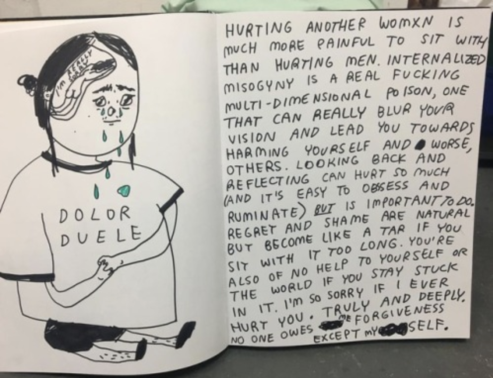
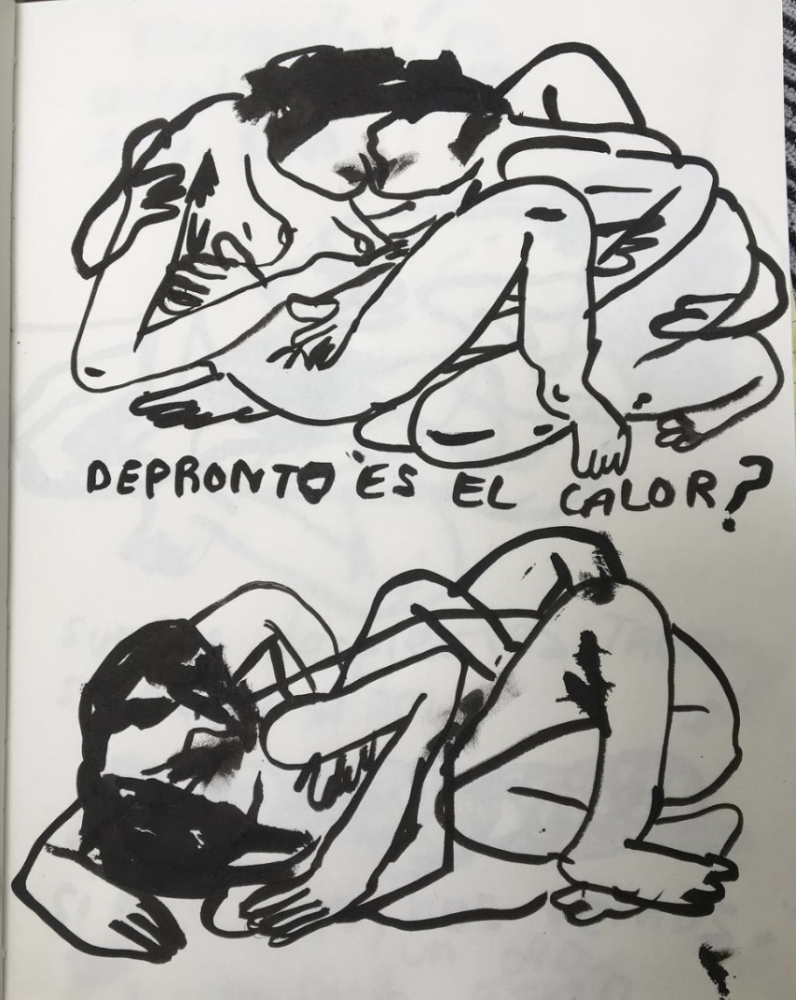

In her own words, Hicks says: "Then there's the absolute: not straight enough to be straight but not gay enough to be gay-ness of me, which categorically leaves me w/ the option of 'bi' which I've had issues with as well and deep conflicts, self-erasure with. Heteronormativity has, very literally, raped me + drained me + warped me + bled me, YET it's all I've ever known + "go for" because it's what's expected, it's safe (yet not at all), and it's been the predominance of my experiences + attractions. But then there's my deviations from that, where I've longed for, had complex/traumatic experiences in queer spaces where I was trying to figure things out, etc. + my constant longing, wondering, considering, and emo-romantic attractions to non-cishet men." In Hick's fluid queerness, she still craves the attention of men because even though she knows she might long for the love of non-cishet men, it's all she's known, and she feels broken by this, as we can see in the illustration that violently juxtaposes the artist's self worth and men. At the same time, she feels the pain of hurting another woman, another _hermana_, like Moraga.

Hicks has an illustration in which two women are kissing and it says "De pronto es el calor?" (June 23, 2018) Hicks also talks about the difficulties of talking to her mother about her possible queerness due to her background. Similar to what Anzaldúa says, "For the lesbian of color, the ultimate rebellion she can make against her native culture .is through her sexual behavior. She goes against two moral prohibitions: sexuality and homosexuality. Being lesbian and raised Catholic, indoctrinated as straight, I _made the choice to be queer_ (for some it is genetically inherent)" (Anzaldúa, _Borderlands_ 19). Hicks is still figuring out her relationship to her own sexuality, questioning her own queerness and the reasons for it, and how it exists within the context of her identity; and that is part of her process of healing.

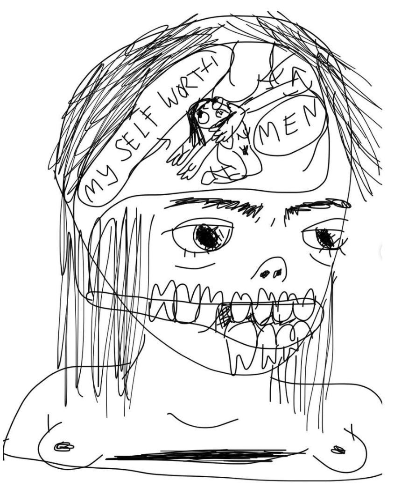

After having discussed some ways in which Hicks thinks about her personal experiences with personhood, querness, and ethnicity, it is also important to think about her own self-reflection about the process in which this art is produced because as Anzaldúa says, "we cannot allow ourselves to be tokenized" (_Bridge_ 166). In her pink/yellow comic she says "realizing how easy it is to fetishize your own pain instead of proactively spending time, realizing it." In a post, she comments "conversing with the shame/guilt associated with intentional seclusion; maybe due to the media/communication landscape we all live in + increasing awareness of codependency (people-pleasing to off-putting and total burnout levels, dread to displease, self-harm in the form of self-neglect, feeling consistently empty without external validators, destabilization when people you mythologize leave and/or reject you). thinking about the roots of burning to please everyone (even one’s self-destruction) ... realizing you’ve been fetishizing + selling out + branding your own pain, as opposed to actually sitting silently to listen to it. breaking the addiction to saying yes as you realize no scares the shit out of you but may actually save you" (Dec 11, 2018).

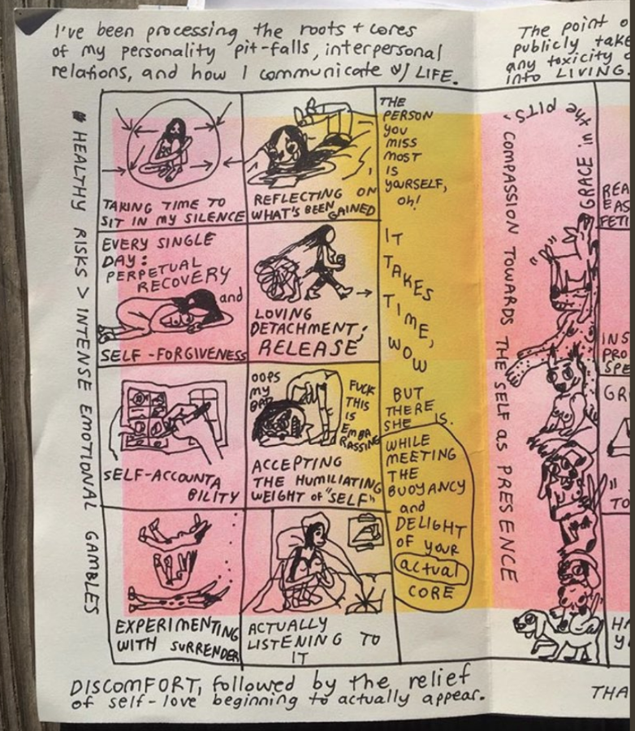
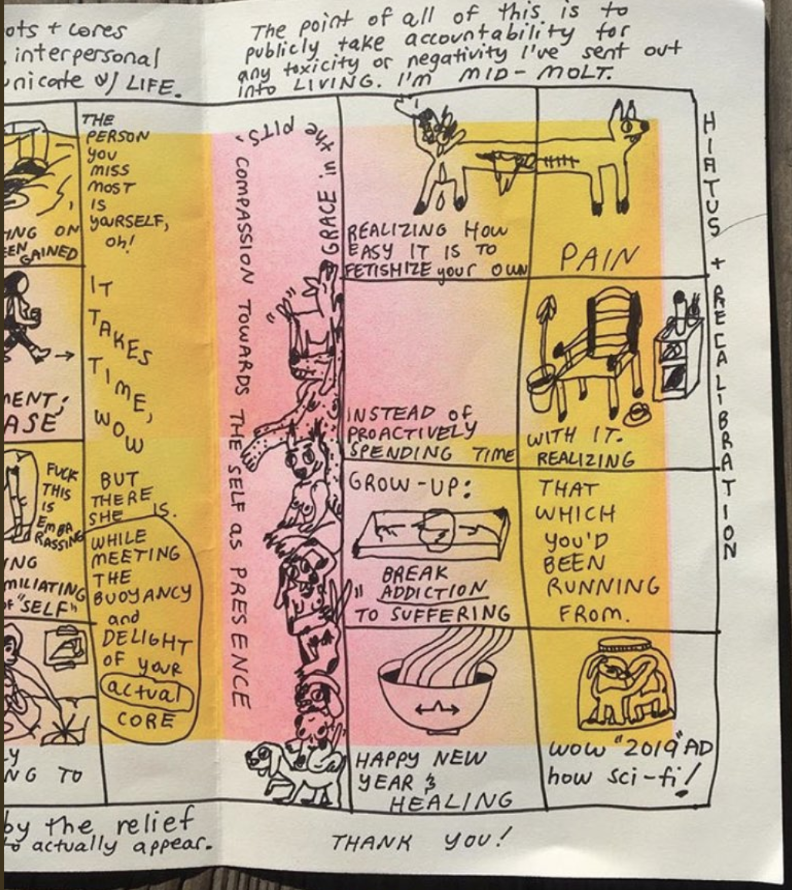

Hicks looks within, the same way in which the Third World Feminist movement looks within, creates movements between and among, and self-reflects; the same way in which there exists growth to look at things, world events, and systems of oppression in not a linear manner but rather a circular intertwinement of factors. During her interview she mentioned many times that she did not want her art to be self-indulgent in a negative way, becoming a marketable #healing art (we laughed). She says, "I think a lot about the queer/poc/healing internet; what are the actual implications? It's important for me to constantly be considering the context. For a long time I felt my work was a bit self-indulgent. I've now shifted to other mediums as well video, music, sculpture. I feel like each medium is research for another medium. I also think a lot about the commodification of art, and my labor now that i'm out of school and its problems." Nonetheless, I argue that in spite of her fears, her art is not one of self-indulgence, given that it is looking within but creating outside for other to process similar pain that comes from displacement, queerness, and displacement within female latinidad.

If Hicks's work transcends to other mediums, it becomes a retroactive creation of theory, in a similar way in which Sandoval expresses the way that differential consciousness creates theory. Going back to Moraga says, "the prism of a US Third World Feminist consciousness has ... turned toward the process of discerning the multilayered and intersecting sites of identity and struggle–distinct and shared– across the globe" (_Bridge_ xvi). Hicks provides us with the starting point to look within, to the unlearned wisdom of the erotic, to that which empowers women of color. Seeing the way in which Hicks is moving to other mediums of expression past the two-dimensional illustration is a beautiful metaphor of what should and is happening with the Third World Feminist movement. It is expanding borders of the US and blurring the lines and binaries that exists. It is learning to live in nepantlas, while also challenging the different powers of oppression. Hick's work transcends the dimensions of identity, in a radical act of going through the pain and healing. The illustrations, sounds, and sculptures that Hick's new art creates take the different forms of pain and healing for Latinas all over the world.

### Works cited

- "Carolina Hicks (@sbtl_clng) • Instagram Photos and Videos." Instagram. Accessed April 30, 2019. https://www.instagram.com/sbtl_clng/.
- Anzalduá, Gloria E., and Analouise Keating. _This Bridge We Call Home: Radical Visions for Transformation_. Routledge, 2002.
- Anzaldúa, Gloria. _Making Face, Making Soul =: Haciendo Caras: Creative and Critical Perspectives by Feminists of Color_. San Francisco: Aunt Lute Foundation Books, 1990.
- Anzaldúa, Gloria, and AnaLouise Keating. _The Gloria Anzaldúa Reader_. Durham, NC: Duke University Press, 2010.
- Anzaldúa, Gloria. _Borderlands: The New Mestiza \= La Frontera_. San Francisco: Aunt Lute Books, 2012.
- Anzaldúa, Gloria, and Cherríe Moraga. _This Bridge Called My Back: Writings by Radical Women of Color_. Albany: SUNY Press, 2015.
- Dykewomon, Elana. "The Body Politic– Meditations on Identity." _This Bridge We Call Home: Radical Visions for Transformation_, edited by Gloria Anzaldúa and Analouise Keating. Routledge, 2002, pp. 450-457.
- Hicks, Carolina. "Brown Student Interested in Writing about Your Art." Received by Carolina Hicks. Conducted by Valentina Cano. 2 May 2019. Email interview.
- Hicks, Carolina. Interview. By Valentina Cano. 5 May 2019. Telephone interview.
- Cano, Valentina. "Brown Student Interested in Writing about Your Art." E-mail to Carolina Hicks. May 2, 2019.
- Lorde, Audre. _Uses of the Erotic: The Erotic as Power_. Tucson: Kore Pr., 2000.
- Moraga, Cherríe. _Loving in the War Years Lo Que Nunca Pasó Por Sus Labios_. Cambridge, MA: South End Press, 1985.
- Person, and Profile Page. "Carolina Hicks on Instagram: "maybe It's the Heat? Sueños Despiertos"." Instagram. Accessed May 31, 2019. https://www.instagram.com/p/BkX05Q5lD6f/.
- Rodriguez, Juana Maria. _Queer Latinidad: Identity Practices, Discursive Spaces_. New York University Press, 2003.
- Sandoval, Chela, and Angela Y. Davis. _Methodology of the Oppressed_. Univ. of Minnesota Press, 2008.
- Violet, Indigo. "Linkages: A Personal Political Journey with Feminist of Color Politics" _This Bridge We Call Home: Radical Visions for Transformation_, edited by Gloria Anzaldúa and Analouise Keating. Routledge, 2002, pp. 486-494.

[^1]: On the origin of the name, Hicks commented: "_Subtle ceiling_ is a combo of factors. The Subtle comes from a time I was 18, riding bikes while a friend and I were on mushrooms and we both noticed many many subtle rainbows in the sky. Ceiling is from a time I was on a silence retreat, and I was very overwhelmed and exhausted, on the top of my bunk bed I started staring for what felt like half an hour at a nail hanging out the ceiling. The harder I focused on it, the more it seemed to be floating and blurring the ceiling so that it seemed closer to me: subtle ceiling. I used that name for a blog I started in 2010 and from there it became like a pseudonym. And now it’s my press name."

[^2]: _Not from here nor from there_
